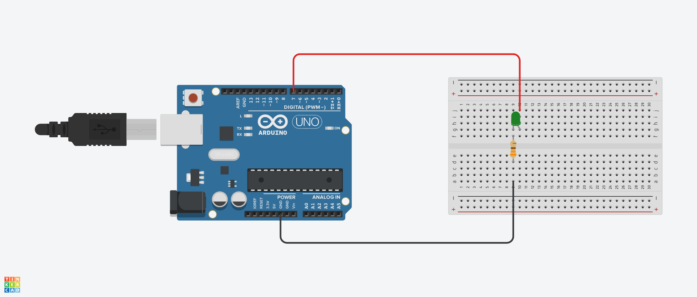

# Ardunio-Project-3
This project use lamp and Serial command prompt for make S.O.S. code.

# Components Used
- 1x LED whatever color you want
- 1x 330 ohm resistance
- Wires
- Ardunio R3

# Circuit Diagram


# Code
```cpp
int red = 7;

void setup() {
  Serial.begin(9600);
  pinMode(red, OUTPUT);
}

void loop() {
  if (Serial.available() > 0) {                   // Eğer bilgisayardan veri geldiyse
    String receivedString = Serial.readString();  // Tüm gelen veriyi oku

    if (receivedString == "SOS" || receivedString == "sos") {                // "SOS" komutu geldiyse
      soscode(red);  // LED'i SOS koduyla yak
    }

    Serial.print("You typed: ");
    Serial.println(receivedString);  // Gelen veriyi ekrana yazdır
  }
}

void soscode(int x) {
  for (int i = 0; i < 3; i++) {  // 3 kısa yanıp sönme
    digitalWrite(x, HIGH);
    delay(200);
    digitalWrite(x, LOW);
    delay(500);
  }

  for (int i = 0; i < 3; i++) {  // 3 uzun yanıp sönme
    digitalWrite(x, HIGH);
    delay(700);
    digitalWrite(x, LOW);
    delay(500);
  }

  for (int i = 0; i < 3; i++) {  // 3 kısa yanıp sönme
    digitalWrite(x, HIGH);
    delay(200);
    digitalWrite(x, LOW);
    delay(500);
  }
}
```

# Code 2

```cpp
int red = 7;

void setup() {
  Serial.begin(9600);
  pinMode(red, OUTPUT);
}

void loop() {
  if (Serial.available() > 0) {                  
    String receivedString = Serial.readString();  
    receivedString.trim();  // Boşlukları ve satır sonlarını kaldır

    Serial.print("You typed: ");
    Serial.println(receivedString);  // Gelen veriyi ekrana yazdır

    if (receivedString == "SOS") {  
      soscode(red);  
    }
  }
}

void soscode(int x) {
  for (int i = 0; i < 3; i++) {  
    digitalWrite(x, HIGH);
    delay(200);
    digitalWrite(x, LOW);
    delay(500);
  }

  for (int i = 0; i < 3; i++) {  
    digitalWrite(x, HIGH);
    delay(700);
    digitalWrite(x, LOW);
    delay(500);
  }

  for (int i = 0; i < 3; i++) {  
    digitalWrite(x, HIGH);
    delay(200);
    digitalWrite(x, LOW);
    delay(500);
  }
}
```


# How to Install
1. Build the circuit with components as shown in the diagram
2. Upload the [code](Code.ino)
3. Change the properties of the serial command prompt to "no line break". Install [code-2](Code-2.ino) instead
4. Type "SOS" or "sos" Serial command prompt
5. Thats it !

# Note
- I want to record video for this project but I can't tell when
